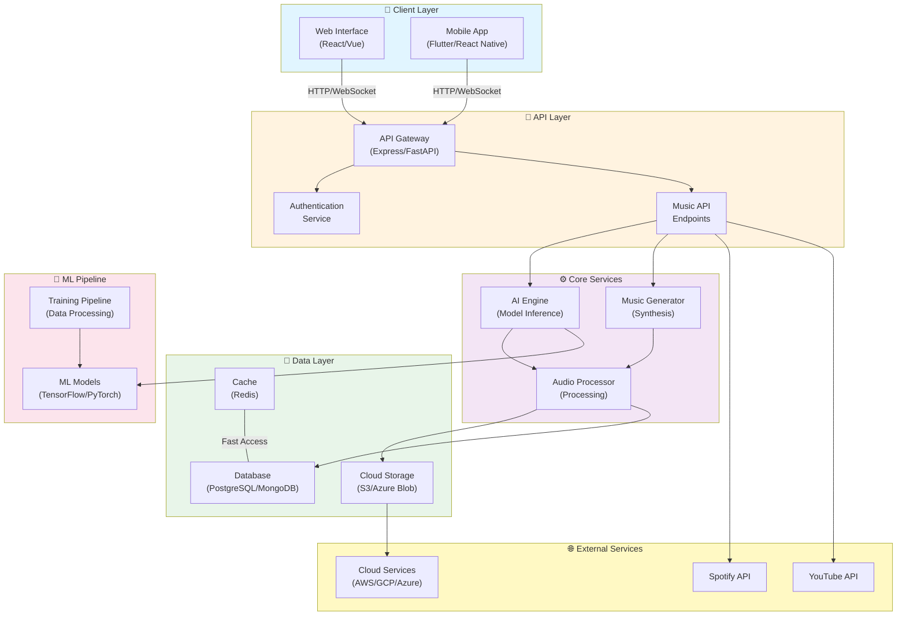

# AI Music - Architecture Overview

## System Architecture

## Component Descriptions

### Client Layer
- **Web Interface**: Browser-based application for accessing music generation and playback features
- **Mobile App**: Native or cross-platform mobile application for on-the-go access

### API Layer
- **API Gateway**: Central entry point for all client requests, handles routing and load balancing
- **Authentication Service**: Manages user authentication, authorization, and token validation
- **Music API Endpoints**: RESTful or GraphQL endpoints for music-related operations

### Core Services
- **AI Engine**: Processes AI models for music analysis and generation
- **Music Generator**: Synthesizes audio based on AI model outputs
- **Audio Processor**: Handles audio manipulation, effects, and format conversion

### Data Layer
- **Database**: Persistent storage for user data, metadata, and configurations
- **Cache**: In-memory caching layer for improved performance
- **Cloud Storage**: Stores generated music files and backups

### ML Pipeline
- **ML Models**: Pre-trained or custom models for music generation
- **Training Pipeline**: Processes training data and handles model updates

### External Services
- **Spotify API**: Integration for music metadata and recommendations
- **YouTube API**: Integration for video content and licensing
- **Cloud Services**: AWS, GCP, or Azure for infrastructure and deployment

## Technology Stack (Recommended)

| Layer | Technology |
|-------|-----------|
| Frontend | React, Vue.js, or Angular |
| Backend | Python (FastAPI/Django), Node.js (Express), or Go |
| Database | PostgreSQL, MongoDB, or DynamoDB |
| Cache | Redis or Memcached |
| ML Framework | TensorFlow, PyTorch, or JAX |
| Storage | AWS S3, Google Cloud Storage, or Azure Blob |
| Containerization | Docker & Kubernetes |
| CI/CD | GitHub Actions, GitLab CI, or Jenkins |

## Data Flow

1. **User Request** → Client sends request to API Gateway
2. **Authentication** → Auth service validates credentials
3. **Processing** → Request routed to appropriate service
4. **AI Processing** → AI Engine processes request using ML models
5. **Generation** → Music Generator creates audio output
6. **Storage** → Output stored in cloud storage and metadata in database
7. **Response** → Generated music returned to client

## Deployment Strategy

- **Containerization**: All services containerized using Docker
- **Orchestration**: Kubernetes for container management and scaling
- **CI/CD Pipeline**: Automated testing and deployment
- **Load Balancing**: Horizontal scaling for high availability
- **Monitoring**: Logging, metrics, and tracing for system observability

---

*Last Updated: 2026-05-14*
